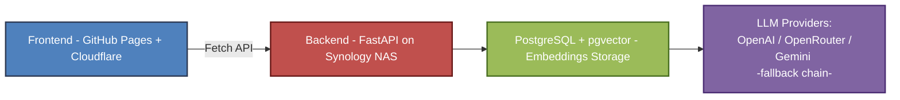

# AI CSV Agent 🤖

 
 
 
 
 
 
 
 
  


An AI-powered agent built with **FastAPI**, **LangChain**, and **Postgres + pgvector**,  
designed to answer questions strictly based on predefined datasets  
(`cv_en.txt`, `cv_es.txt`, `cv_fr.txt`, `faq_en.txt`, `faq_es.txt`, `faq_fr.txt`).  

Supports **multiple LLM providers with automatic fallback**:  
- OpenAI (`gpt-3.5-turbo`)  
- OpenRouter (`x-ai/grok-4-fast:free`)  
- Google Gemini (`gemini-2.5-flash`)  

This project is structured with a focus on **professionalism, scalability, and maintainability**,  
featuring clean architecture, centralized logging, consistent error handling, and typed schemas.


---

## 📂 Project Structure

```
ai-csv-agent/
├── app/
│   ├── config/              # Environment configuration
│   ├── models/              # SQLAlchemy models
│   ├── routers/             # API routes (agent, health, logs)
│   ├── schemas/             # Pydantic schemas for requests/responses
│   ├── services/            # Business logic (vector store, logs, seeders)
│   └── utils/               # Utilities (db, logger, error handler, LLM)
├── data/                    # Datasets for embeddings
│   ├── cv_en.txt            # CV content (English)
│   ├── cv_es.txt            # CV content (Spanish)
│   ├── cv_fr.txt            # CV content (French)
│   ├── faq_en.txt           # FAQ (English)
│   ├── faq_es.txt           # FAQ (Spanish)
│   └── faq_fr.txt           # FAQ (French)
├── Dockerfile               # Docker build file
├── docker-compose.yml       # Docker orchestration (FastAPI + Postgres)
├── requirements.txt         # Python dependencies
└── README.md                # Project documentation
```

---

## ⚙️ Requirements

- Python **3.11+**
- PostgreSQL with **pgvector** extension
- Docker + Docker Compose
- API Keys (configure depending on which LLM providers you want to enable):
  - [OpenAI API Key](https://platform.openai.com/)  
  - [OpenRouter API Key](https://openrouter.ai/)  
  - [Gemini API Key](https://ai.google.dev/)  

➡️ The priority and fallback order is defined in `.env` using `LLM_PROVIDERS`.  
Example:  

```env
LLM_PROVIDERS=["openai", "openrouter", "gemini"]
```

---

## 🚀 Local Setup

1. Clone the repository and install dependencies:

```bash
git clone https://github.com/jorgechavarriaga/ai-csv-agent.git
cd ai-csv-agent
python -m venv .venv-ai-agent
source .venv-ai-agent/bin/activate   # Linux/Mac
.venv-ai-agent\Scripts\activate      # Windows
pip install -r requirements.txt
```

2. Configure environment variables in `.env`:

```env
# Database
POSTGRES_USER=ai_user
POSTGRES_PASSWORD=super_secret
POSTGRES_HOST=localhost
POSTGRES_PORT=5432
POSTGRES_DB=ai_agent

# Switch to True to create tables on startup
ENABLE_FORCE_SEED=False

# LLM Providers API Keys
OPENAI_API_KEY=sk-...
OPENROUTER_API_KEY=sk-or-...
GEMINI_API_KEY=AIzaSy....

DATABASE_URL=postgresql+psycopg://${POSTGRES_USER}:${POSTGRES_PASSWORD}@${POSTGRES_HOST}:${POSTGRES_PORT}/${POSTGRES_DB}
```

3. Load your datasets into the `/data` folder:

```
data/cv_en.txt ← Jorge's background, studies, experience (English)
data/cv_es.txt ← Jorge's background, studies, experience (Spanish)
data/cv_fr.txt ← Jorge's background, studies, experience (French)

data/faq_en.txt ← FAQ: recruiter-oriented questions (English)
data/faq_es.txt ← FAQ: recruiter-oriented questions (Spanish)
data/faq_fr.txt ← FAQ: recruiter-oriented questions (French)
```

4. Run the server:
```bash
uvicorn app.main:app --reload
```

---

## 🧠 How It Works

When a question is sent to the agent:

1. **Frontend → Backend:**  
   The frontend sends a payload with `session_id`, `question`, and `language` (`en | es | fr`).  

2. **Language-specific retrieval:**  
   - The backend routes the query to the corresponding vector stores (`cv_xx` + `faq_xx`) for the selected language.  
   - If no results are found in that language, the agent gracefully falls back to English collections.  

3. **Source prioritization:**  
   - The most relevant source is selected based on **average similarity score**.  
   - `faq` is prioritized for recruiter-style or preference/logistics questions.  
   - `cv` is prioritized for technical and professional background.  

4. **LLM Fallback:**  
   - The agent tries providers in the order defined in `.env → LLM_PROVIDERS`.  
   - Example: `["openai", "openrouter", "gemini"]`  
     - If OpenAI fails, it automatically switches to OpenRouter.  
     - If OpenRouter also fails, it falls back to Gemini.  
   - If all providers are offline, the agent returns a standardized error response.  

5. **Strict prompting:**  
   - The LLM receives only curated context.  
   - Responses are strictly limited to CV + FAQ content.  
   - If the information is not explicitly present, the LLM is instructed **not to answer**.  

---

## 🛠️ API Endpoints

### 0. Health Check (backend only)

**GET** `/api/v1/health`  
Verifies that the API is alive.  

✅ Example response:
```json
{
  "status": "success",
  "data": {
    "status": "ok"
  }
}
```

### 1. Health Check (LLM providers)

**GET** `/api/v1/health/ai`  
Checks the availability of the LLM service with provider fallback.

✅ Example response:

```json
{
  "status": "success",
  "data": {
    "status": "online",
    "provider": "gemini"
  }
}
```

If no provider is available:

```json
{
  "status": "error",
  "error": {
    "code": 503,
    "message": "LLM service unavailable"
  }
}
```
---

### 2. Ask Agent

**POST** `/api/v1/ask`

📩 Request body:

```json
{
  "session_id": "1da8b06f-a8c0-4bb9-84d7-c39355175676",
  "question": "Where does Jorge work?",
  "language": "en"
}
```

✅ Example response:

```json
{
    "status": "success",
    "data": {
        "question": "Where does Jorge work?",
        "answer": "Jorge works at CodeBoxx Digital Solutions in Canada."
    }
}
```

ℹ️ `language` must be one of: `"en"`, `"es"`, `"fr"`.  
If not provided or unsupported, the backend defaults to English.  

---

### 3. Logs

**GET** `/api/v1/logs?limit=50`  
Retrieves recent questions and answers.

---

## ⚠️ Error Handling

All errors follow a standard format:

```json
{
  "status": "error",
  "error": {
    "code": 500,
    "message": "Something went wrong"
  }
}
```

Handled cases include:

- `401 Unauthorized`
- `404 Not Found`
- `422 Validation Error`
- `429 Too Many Requests`
- `503 Vector store not available`
- `500 Internal Server Error`

---

## 🏗️ Architecture



- **Frontend** → Static site with CV + chatbot widget.
  Sends payload including `session_id`, `question`, and `language` (en|es|fr).

- **Backend** → FastAPI API exposed via reverse proxy.
  Routes queries to `cv_xx_embeddings` and `faq_xx_embeddings` collections based on language,
  with automatic fallback to English if no results are found.

- **DB** → Stores embeddings and logs.

- **LLM Providers** → Flexible chain of providers:

  - Primary: OpenAI
  - Fallback: OpenRouter
  - Secondary fallback: Gemini

If all providers fail, the API responds with a standardized error. 

---

## 📦 Tech Stack

- **Frontend**: HTML, CSS, JS, Bootstrap, jQuery, FontAwesome  
- **Backend**: FastAPI, Docker, PostgreSQL, pgvector, SQLAlchemy, LangChain  
- **LLM Providers (fallback chain)**:  
  - OpenAI (`gpt-3.5-turbo`)  
  - OpenRouter (`x-ai/grok-4-fast:free`)  
  - Gemini (`gemini-2.5-flash`)  
- **Infra**: GitHub Pages, Cloudflare (DNS + SSL), Synology NAS (DS224+)  

---

## 🔒 Key Features

- ✅ Answers strictly limited to CV + FAQ datasets (EN, ES, FR).  
- ✅ Online/Offline status check for assistant.  
- ✅ Multi-LLM fallback: OpenAI → OpenRouter → Gemini.  
- ✅ Multilingual support: embeddings and responses available in English, Spanish, and French (with fallback to English if missing).  
- ✅ Dockerized backend for portability and easy deployment.  
- ✅ Cloudflare SSL & domain management.  
- ✅ Centralized logging and session-based isolation (per `session_id`).  


---

## 📝 Roadmap

📦 This repo covers only the **backend** logic.

### Phase 1 — Context + Isolation
- ✅ `session_id` support (isolated sessions per visitor)
- ✅ Logs per session
- ✅ Prioritization logic (`faq` vs `cv`)
- 🟡 Context window size optimization

### Phase 2 — Frontend integration
- ✅ Embedded chatbot widget on CV site
- 🟡 Multi-language UI improvements

### Phase 3 — Dockerization
- ✅ Implemented with Dockerfile + docker-compose

### Phase 4 — Multi-LLM Fallback
- ✅ OpenAI → OpenRouter → Gemini chain

### Phase 5 — Future Enhancements
- 🔲 Advanced analytics dashboard for logs
- 🔲 Real-time provider metrics
- 🔲 Expand to more LLM providers if needed

---

## 👨‍💻 Author

Built by **Jorge Chavarriaga**  
🔗 [LinkedIn](https://www.linkedin.com/in/jorge-chava/) | [GitHub](https://github.com/jorgechavarriaga/)

---

## 🔁 Changelog

- Split context into `cv_en.txt` and `faq_en.txt`
- Added multilingual datasets (`cv_es`, `cv_fr`, `faq_es`, `faq_fr`)
- Enhanced context scoring and source prioritization
- Enforced "only from context" answering rule
- Added `/api/v1/health/ai` endpoint (LLM health check)
- Dockerized backend with PostgreSQL + pgvector
- Implemented multi-LLM fallback (OpenAI → OpenRouter → Gemini)
