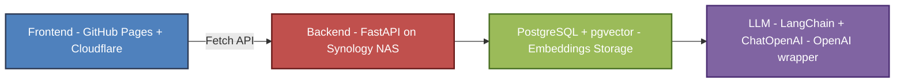

# AI CSV Agent 🤖

 
 
 
 
 
 
  

An AI-powered agent built with **FastAPI**, **LangChain + ChatOpenAI**, **Postgres + pgvector**,  
designed to answer questions strictly based on predefined datasets (`cv_en.txt` and `faq_en.txt`).

This project is structured with a focus on **professionalism, scalability, and maintainability**,  
featuring clean architecture, centralized logging, consistent error handling, and typed schemas.

---

## 📂 Project Structure

```
ai-csv-agent/
├── app/
│   ├── config/              # Environment configuration
│   ├── models/              # SQLAlchemy models
│   ├── routers/             # API routes (agent, health, logs)
│   ├── schemas/             # Pydantic schemas for requests/responses
│   ├── services/            # Business logic (vector store, logs, seeders)
│   └── utils/               # Utilities (db, logger, error handler, LLM)
├── data/                    # Datasets for embeddings
│   ├── cv_en.txt            # CV content (technical, academic, experience)
│   └── faq_en.txt           # Frequently asked questions (preferences, logistics)
├── Dockerfile               # Docker build file
├── docker-compose.yml       # Docker orchestration (FastAPI + Postgres)
├── requirements.txt         # Python dependencies
└── README.md                # Project documentation
```

---

## ⚙️ Requirements

- Python **3.11+**
- PostgreSQL with **pgvector** extension
- [OpenAI API Key](https://platform.openai.com/)
- Docker + Docker Compose

---

## 🚀 Local Setup

1. Clone the repository and install dependencies:

```bash
git clone https://github.com/jorgechavarriaga/ai-csv-agent.git
cd ai-csv-agent
python -m venv .venv-ai-agent
source .venv-ai-agent/bin/activate   # Linux/Mac
.venv-ai-agent\Scripts\activate      # Windows
pip install -r requirements.txt
```

2. Configure environment variables in `.env`:

```env
POSTGRES_USER=ai_user
POSTGRES_PASSWORD=super_secret
POSTGRES_HOST=localhost
POSTGRES_PORT=5432
POSTGRES_DB=ai_agent

# Switch to True to create tables
ENABLE_FORCE_SEED=False

OPENAI_API_KEY=sk-xxxx

# USER = POSTGRES_USER, PWD = POSTGRES_PASSWORD, DB = POSTGRES_DB
DATABASE_URL=postgresql+psycopg://USER:PWD:5432/DB
```

3. Load your datasets into the `/data` folder:

```
data/cv_en.txt     ← Jorge's background, studies, experience
data/faq_en.txt    ← FAQ: recruiter-oriented questions
```

4. Run the server:
```bash
uvicorn app.main:app --reload
```

---

## 🧠 How It Works

When a question is sent to the agent:

1. It runs similarity search over **both** `cv_en` and `faq_en` vectors.
2. The most relevant source is selected based on **average similarity**.
3. Context is injected into the LLM with a strict prompt:
   - Do **not** answer if the info is not explicitly present.
   - Prefer `faq` for questions about **preferences or logistics**.

---

## 🛠️ API Endpoints

### 1. Health Check

**GET** `/api/v1/health/ai`  
Verifies the API and LLM are online.

✅ Example response:

```json
{
    "status": "success",
    "data": {
        "status": "online"
    }
}
```


---

### 2. Ask Agent

**POST** `/api/v1/ask`

📩 Request body:

```json
{
  "session_id": "1da8b06f-a8c0-4bb9-84d7-c39355175676",
  "question": "Where does Jorge work?"
}
```

✅ Example response:

```json
{
    "status": "success",
    "data": {
        "question": "Where does Jorge work?",
        "answer": "Jorge works at CodeBoxx Digital Solutions in Canada."
    }
}
```

---

### 3. Logs

**GET** `/api/v1/logs?limit=50`  
Retrieves recent questions and answers.

---

## ⚠️ Error Handling

All errors follow a standard format:

```json
{
  "status": "error",
  "error": {
    "code": 500,
    "message": "Something went wrong"
  }
}
```

Handled cases include:

- `401 Unauthorized`
- `404 Not Found`
- `422 Validation Error`
- `429 Too Many Requests`
- `503 Vector store not available`
- `500 Internal Server Error`

---

## 🏗️ Architecture



- **Frontend** → Static site with CV + chatbot widget.  
- **Backend** → FastAPI API exposed via reverse proxy.  
- **DB** → Stores embeddings and logs.  
- **LLM** → Uses LangChain’s `ChatOpenAI` class to call OpenAI chat models.  

---

## 📦 Tech Stack

- **Frontend**: HTML, CSS, JS, Bootstrap, jQuery, FontAwesome.  
- **Backend**: FastAPI, Docker, PostgreSQL, pgvector, SQLAlchemy, LangChain.  
- **LLM Integration**: LangChain + `ChatOpenAI` (wrapper for OpenAI’s GPT models).  
- **Infra**: GitHub Pages, Cloudflare (DNS + SSL), Synology NAS (DS224+).  

---

## 🔒 Key Features

- ✅ Answers strictly limited to CV + FAQ.  
- ✅ Online/Offline status check for assistant.  
- ✅ Dockerized backend for portability.  
- ✅ Cloudflare SSL & domain management.  
- ✅ Multilanguage CV rendering (EN, FR, ES).  

---

## 📝 Roadmap

📦 This repo covers only the **backend** logic.

### Phase 1 — Context + Isolation
- ✅ `session_id` support
- ✅ Logs per session
- ✅ Prioritization logic (`faq` vs `cv`)
- 🟡 Context window size optimization

### Phase 2 — Frontend integration
- Tracked in [separate web repo]

### Phase 3 — Dockerization
- ✅ Implemented with Dockerfile + docker-compose

---

## 👨‍💻 Author

Built by **Jorge Chavarriaga**  
🔗 [LinkedIn](https://www.linkedin.com/in/jorge-chava/) | [GitHub](https://github.com/jorgechavarriaga/)

---

## 🔁 Changelog

- Split context into `cv_en.txt` and `faq_en.txt`
- Enhanced context scoring and source prioritization
- Enforced "only from context" answering rule
- Added `/api/v1/health/ai` endpoint
- Dockerized backend with PostgreSQL + pgvector
